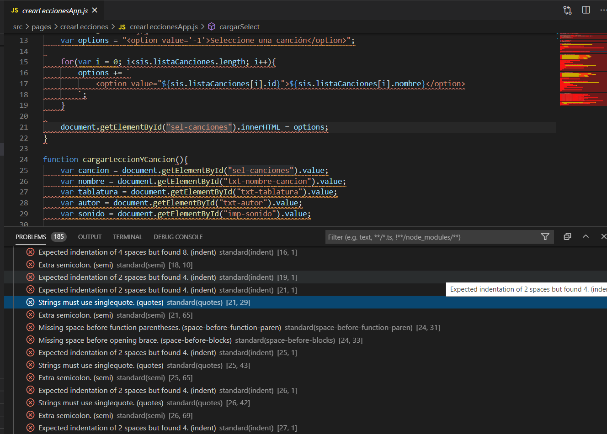
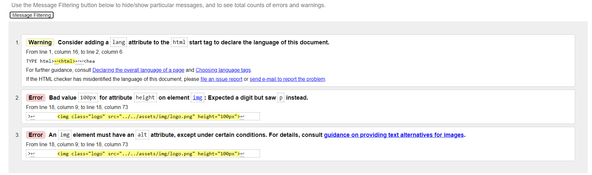
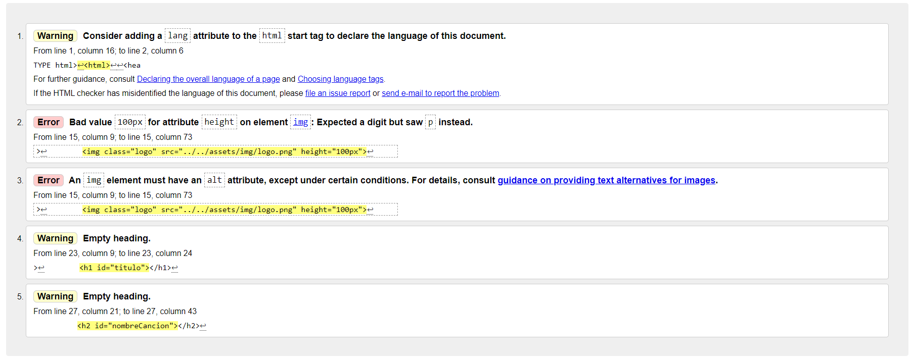
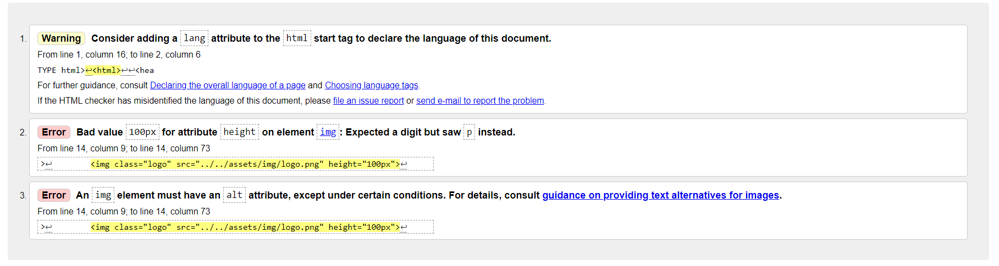
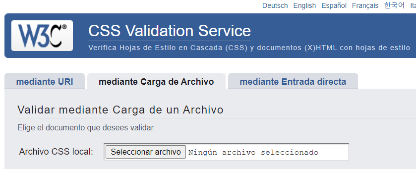
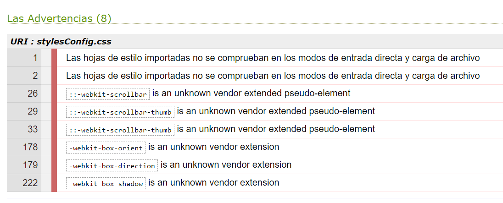
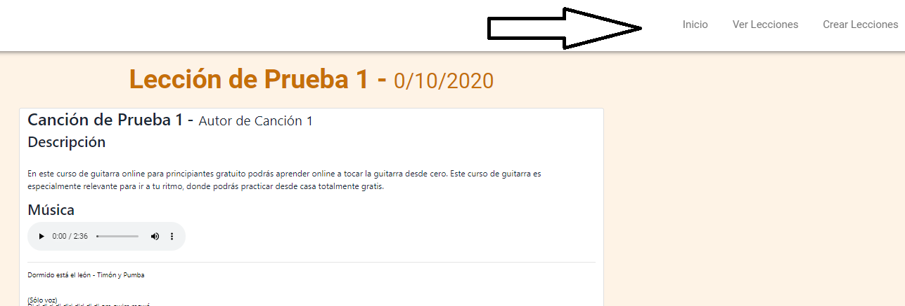

# Fundamentos de Ingeniería de Software
# Obligatorio 2
___Versión 1.0___

**N4A, Docente: Gerardo Quintana, Martín D'Uva**

**Integrantes: Cristian Palma, Valeria Vera, Federico Alonso.**

23 de noviembre de 2020

**URL del repositorio: https://github.com/ORT-FIS-202008/ob2-ort-fis-obl2-alonso-palma-vera**

# ÍNDICE

### 1. [PREFACIO](#I1)
### 2. [GLOSARIO](#I2)
### 3. [PROCESO DE BUILD](#I3)
- ### 3.1. [Clonar el Repositorio](#I31)
- ### 3.2. [Instalar la Aplicación](#I32)
### 4. [CALIDAD DE CÓDIGO](#I4)
- ### 4.1. [Código en JavaScript](I41)
- ### 4.2. [Código en HTML y CSS](I42)
### 5. [PRUEBAS UNITARIAS](#I5)

# 1. PREFACIO 

El presente repositorio cuenta con la aplicación solicitada por el obligatorio, así como con el estudio de funcionalidad, usabilidad, testig e interfaz de usuario desarrollado a partir de la misma.

Se compone de una estructura de carpetas, en las que se encuentra todo lo necesario para implementar la misma, se desarrolla el procedimiento en la sección [Proceso de build](#I3). Como pasos previos para el mismo se debe tener instalado en el ordenador nodejs, visual studio code y git.

# 2. GLOSARIO 

Se especifíca la terminología utilizada a lo largo del documento:

- *Software:* Conjunto de programas que permiten a la computadora realizar determinadas tareas
- *Usuario*: Persona que utiliza el sistema.
- *Responsive*: Diseño de página web que se adapta de forma automática a la resolución de la pantalla donde está siendo visualizado y a diferentes tipos de dispositivos.
- *Plataforma:* Sistema que permite la ejecución de diversas aplicaciones bajo un mismo entorno, dando a los usuarios la posibilidad de acceder a ellas a través de Internet.
- *Caso de uso:* Secuencia de transacciones que son desarrolladas por un sistema en respuesta a un evento que inicia un actor sobre el propio sistema.
- *Diagrama de casos de uso:* Diagrama que muestra la relación entre los actores y los casos de uso en un sistema.
- *Requerimiento:* Condición o capacidad de un sistema requerida por el usuario para resolver un problema o alcanzar un objetivo.

# 3. PROCESO DE BUILD 

A continuación se detallan los pasos a seguir para ejecutar la aplicación en un entorno local.

## 3.1. Clonar el Repositorio 

Acceder en el navegador a la [Ruta del Repositorio] (https://github.com/ORT-FIS-202008/ob2-ort-fis-obl2-alonso-palma-vera).

Copiar la ruta para clonar el mismo.

En una nueva carpeta en el ordenador personal, hacer click derecho con el mouse y seleccionar "Git Bash Here".

Introducir el comando:

    - git clone https://github.com/ORT-FIS-202008/ob2-ort-fis-obl2-alonso-palma-vera

Acceder a la carpeta creada con el siguiente comando:

    - cd ob2-ort-fis-obl2-alonso-palma-vera

## 3.2. Instalar la Aplicación 

Una vez posicionados en la carpeta se debe correr el comando:

    - npm install

Se entiende que ya se tiene instalado nodejs en el ordenador, de lo contrario se debe realizar con anterioridad, por más información visitar [el sitio oficial de nodejs](https://nodejs.org/es/).

Luego de la instalación de dependencias, se procede con la actualización de los archivos .js. 

Este proceso sirva para que la aplicación funcione con normalidad sin necesidad de levantarla desde un servidor, además de no tener la necesidad de utilizar archivos de clase distintos para correr las pruebas jest. 

Se debe aplicar el siguiente comando:

    - npm run start

Después se aplica webpack para minificar los archivos, por lo que mejorará el rendimiento de la aplicación, se debe aplicar el siguiente comando:

    - npm run build

Para finalizar se accede a la carpeta y se hace doble click sobre el index.html

# 4. CALIDAD DE CÓDIGO 

El equipo estableció que el estándar de codificación sea el de Google:

[Estandar de google](http://google.github.io/styleguide/), tanto para HTML/ CSS, como para JavaScript.

De esta manera, facilitó el trabajo en equipo, ya que se hizo más fácil leer el código de todos los integrantes del grupo.

Una de las técnicas utilizadas para mejorar la calidad del código consistió en la revisión de código, por cuestiones de tiempo el primer objetivo deseado fue tener la estructura de la página funcionando en detrimento de la calidad del código, pero de esta forma pudimos dividirnos mejor el trabajo, lo cual nos permitió trabajar en paralelo en el testing exploratorio, y la revisión de código y así asegurar el cumplimento de los estándares antes mencionados, para los cuales según la tecnología de desarrollo se encaró de distintas maneras:

## 4.1. Código en JavaScript

Además, concordamos en utilizar las siguientes herramientas que nos fueron de ayuda para aplicar estos estándares:

- Plugin de VsCode: [JSHint](https://jshint.com/docs/options/)
- Para mejorar el Formateo, vimos que la documentación de Google recomendaba [clang-format](http://clang.llvm.org/docs/ClangFormatStyleOptions.html)

El plugin clang-format nos ayudó a detectar bastantes errores como por ejemplo:

- Indentación.
- Sangría.
- Wspacios en blanco.
- Mal uso de “var” para variables, sugiriendo usar “let” y “const” para los casos que la variable no tenía ninguna reasignación del valor.
- Uso de comillas simples para String.
- Estructuras de control, abertura y clausura.

Cabe aclarar, que fue ignorada la recomendación que sugería eliminar el punto y coma al final de cada sentencia, pero que si era recomendado por el plugin JsHint.

## 4.2. Código en HTML y CSS 

Además, concordamos en utilizar las siguientes herramientas que nos fueron de ayuda para aplicar estos estándares:

Como herramienta para la validación del código HTML y CSS, subimos nuestro código al siguiente sitio [validador](https://validator.w3.org/#validate_by_upload), obteniendo los siguientes resultados:

- en la página crearLecciones.html

- en la página realizarLección.html

- en la página verLecciones.html 

- Validación del css en [jigsaw.w3.org](https://jigsaw.w3.org/css-validator/)

- En el archivo stylesConfig.css

Para mejorar aún más la calidad del código, y la compresión de todos los miembros del equipo, pusimos especial énfasis en la documentación del código cuando la complejidad ameritaba, para lo cual utilizamos los estándares recomendados por JSDoc.

# 5. PRUEBAS UNITARIAS

Se configuran pruebas unitarias para el proceso de detección de errores en el dominio del sistema creado. La herramienta utilizada para el procedimiento es jestjs (para mayor información visitar su [sitio oficial](https://jestjs.io/)).

El detalle de lo realizado con la aplicación de la herramienta se encuentra en el [estudio de pruebas unitarias](src/tests/README.md).

Para correr las prebas unitarias sobre el sistema, se debe aplicar el comando:

    - npm run test

El resultado del mismo es una cobertura del 100% de las funciones. y un 100% de las líneas de código.

Como aprendizaje se obtuvo que es más fiable contar con la herramienta, se verifica que al momento de realizar cambios en la aplicación o reestructura de código, se tiene el respaldo de las pruebas para corroborar que el código sigue funcionando como corresponde, por lo que el trabajo realizado una única vez ahorra tiempo de pruebas a futuro.

# 6. INTERFAZ DE USUARIO 

Para hacer el desarrollo de la interfaz de usuario, clasificamos en primera instancia cuales páginas iban a ser utilizadas por los niños (*realizarLeccion.html* y *verLeccion.html*) y por otra parte la página en la cual iba a ser utilizada por un adulto, quien tiene la responsabilidad de subir el contenido a la página (*crearLecciones.html*).

El foco principal en esta primera versión fue hacer lo más fácil posible el uso de la aplicación, tomando las siguientes métricas para su posterior evaluación:

- Tiempo de aprendizaje (el niño debe ser capaz la primera vez que ingresa al sitio de poder llegar a la página de realizar una lección en un tiempo menor o igual a 2 minutos).
- Velocidad de operación (desde la página de *inicio.html*, en dos clicks el niño ya puede ver la lección).

Respecto a la página de *crearLecciones.html*, la medición se hizo en el siguiente aspecto:

- Tiempo de aprendizaje. (el adulto debe ser capaz la primera vez que utiliza la aplicación, de poder crear una nueva lección en el sistema en un tiempo menor o igual a 5 minutos).

En cuanto a la accesibilidad del sistema, por factor tiempo que contamos para el desarrollo de la aplicación, se decidió no hacer énfasis en este aspecto, pero si documentar las mejoras que eventualmente se podrían tomar en cuenta para desarrollar a futuro, para la cual utilizamos una herramienta llamada [“AChequer”](https://achecker.ca/checker/index.php), la cual hace un chequeo de verificación de los estándares [WCAG 1.0](https://www.w3.org/TR/WAI-WEBCONTENT/) y [WCAG 2.0](https://www.w3.org/TR/WCAG20/), en todos sus niveles: 

- Perceptible.
- Operable.
- Comprensible.
- Robusto.

En nuestro proyecto, utilizamos [“Bootstrap”](https://getbootstrap.com/docs/4.1/getting-started/introduction/) con los siguientes objetivos:

- Hacer una página web con diseño responsivo.
- Como equipo nos pareció rápido de aprender a usar.
- Ser consistentes en todo el proyecto con el mismo estilo de diseño.

## 6.1. Evaluación de la usabilidad 

Para lograr este objetivo utilizamos las siguientes técnicas:

- Análisis Heurístico.
- Pruebas con usuarios.

### 6.1.1. Análisis heurístico 

Para evaluar la usabilidad de la interfaz utilizamos las heurísticas de Nielsen, entre los miembros del equipo nos repartimos las heurísticas a analizar realizando una inspección de la interfaz para evaluar la calidad de la misma a partir del cumplimiento de los principios heurísticos. Se utilizan los principios heurísticos de Nielsen por ser los más reconocidos universalmente.

Resultado del Análisis:
 
1. Principio visibilidad del estado del sistema: 

**NO CUMPLE** -Se ejecuta el sistema y se observa que no se mantiene a los usuarios informados sobre lo que ocurre, a través de una retroalimentación apropiada. Se despliegan mensajes de error poco específicos que no le indican al usuario el problema que ha ocurrido y como solucionarlo, en la página cuando el alumno se encuentra realizando una lección, no se sabe en que punto de la navegación nos encontramos.

2. Empate entre el sistema y el mundo real: 

**CUMPLE** -El lenguaje es conocido para el usuario, no se encontró algún concepto complejo para la compresión de un niño (en las páginas -*realizarLeccion.html* y *verLeccion.html*)

3. Control y libertad del usuario:

**NO CUMPLE** -El sistema no contiene una ‘puerta de emergencia’ para salir del estado indeseado, es decir no ofrece soporte para deshacer y rehacer acciones, esto se puede notar en la función de crear lección, una vez confirmada esta acción, no se puede deshacer, y ni siquiera el sistema ofrece la posibilidad de eliminar una lección existente.

4. Consistencia y estándares: 

**CUMPLE** -Se utiliza en todo el documento los estándares de clases de Bootstrap, manteniendo el documento homogéneo en cuanto a tamaño de botones, colores, fuente, entre otras. Si bien se utilizan clases especiales en ciertas ocaciones, estas no varían los estándares de Bootstrap.

5. Prevención de errores:

**NO CUMPLE** -No se informan las características que debe tener cada campo a completar en la pantalla crear lecciones (tipo de texto, largo máximo y mínimo). Los errores son reportados luego de haber sido cometidos al querer crear una lección con algún error.

6. Reconocimiento mejor que recuerdo: 

**NO APLICA** -El usuario no debe recordar la información de una parte del diálogo a otra. Cada pantalla contiene la información necesaria para ser utilizada sin excederse para que el usuario no tenga un sobrecargo de información.

7. Flexibilidad y eficiencia de uso:

**NO APLICA** -No se utilizan aceleradores y teclas con funciones específicas ya que por el alcance del proyecto es muy básica la funcionalidad a desarrollar, no se diferencias usuarios principiantes y expertos.

8. Diseño estético y minimalista:

**CUMPLE** -El sistema es muy básico, no contiene información irrelevante. El diseño es intuitivo y sencillo. 

9. Ayudar a reconocer, diagnosticar y recuperarse de errores: 

**CUMPLE** -Los mensajes de error informan exactamente el motivo por el cual no se pudo realizar una acción indicando con exactitud el error en cuestión. Esto se aplica en la página de *crearLeccion.html*, ya que es en la única donde el usuario puede cometer un error.

10. Ayuda y documentación: 

**NO CUMPLE**- No se provee ayuda y documentación para el usuario. 

Conclusiones del Análisis heurístico:

Se puede apreciar en el análisis heurístico que menos de un tercio de las heurísticas se cumplen, por lo que no se puede asegurar la usabilidad del sistema. Deberán implementarse diversas mejoras en el diseño en futuras versiones para así lograr el objetivo deseado. La principal causa de que no se puedan cumplir con la mayoría de las heurísticas se debe al factor tiempo que se dispone para realizar el desarrollo del sitio.

## 6.1.2 Pruebas con usuarios 

# 7. TESTING FUNCIONAL

# 8. REPORTE DE DEFECTOS

# 9. TRABAJO DEL EQUIPO

# 10. REFLEXIÓN
