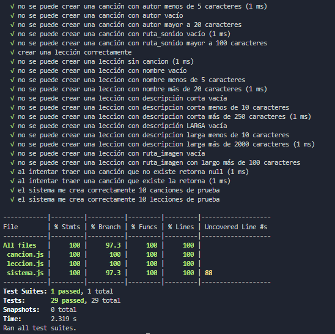

# Fundamentos de Ingeniería de Software
# Obligatorio 2
___Versión 1.0___

**N4A, Docente: Gerardo Quintana, Martín D'Uva**

**Integrantes: Cristian Palma, Valeria Vera, Federico Alonso.**

23 de noviembre de 2020

**URL del repositorio: https://github.com/ORT-FIS-202008/ob2-ort-fis-obl2-alonso-palma-vera**

# ÍNDICE

### 1. [PREFACIO](#I1)
### 2. [GLOSARIO](#I2)
### 3. [PROCESO DE BUILD](#I3)
- ### 3.1. [Clonar el Repositorio](#I31)
- ### 3.2. [Instalar la Aplicación](#I32)

# 1. PREFACIO 

El presente repositorio cuenta con la aplicación solicitada por el obligatorio, así como con el estudio de funcionalidad, usabilidad, testig e interfaz de usuario desarrollado a partir de la misma.

Se compone de una estructura de carpetas, en las que se encuentra todo lo necesario para implementar la misma, se desarrolla el procedimiento en la sección [Proceso de build](#I3). Como pasos previos para el mismo se debe tener instalado en el ordenador nodejs, visual studio code y git.

# 2. GLOSARIO 

Se especifíca la terminología utilizada a lo largo del documento:

- *Software:* Conjunto de programas que permiten a la computadora realizar determinadas tareas
- *Usuario*: Persona que utiliza el sistema.
- *Responsive*: Diseño de página web que se adapta de forma automática a la resolución de la pantalla donde está siendo visualizado y a diferentes tipos de dispositivos.
- *Plataforma:* Sistema que permite la ejecución de diversas aplicaciones bajo un mismo entorno, dando a los usuarios la posibilidad de acceder a ellas a través de Internet.
- *Caso de uso:* Secuencia de transacciones que son desarrolladas por un sistema en respuesta a un evento que inicia un actor sobre el propio sistema.
- *Diagrama de casos de uso:* Diagrama que muestra la relación entre los actores y los casos de uso en un sistema.
- *Requerimiento:* Condición o capacidad de un sistema requerida por el usuario para resolver un problema o alcanzar un objetivo.

# 3. PROCESO DE BUILD 

A continuación se detallan los pasos a seguir para ejecutar la aplicación en un entorno local.

## 3.1. Clonar el Repositorio 

Acceder en el navegador a la [Ruta del Repositorio] (https://github.com/ORT-FIS-202008/ob2-ort-fis-obl2-alonso-palma-vera).

Copiar la ruta para clonar el mismo.

En una nueva carpeta en el ordenador personal, hacer click derecho con el mouse y seleccionar "Git Bash Here".

Introducir el comando:

    - git clone https://github.com/ORT-FIS-202008/ob2-ort-fis-obl2-alonso-palma-vera

Acceder a la carpeta creada con el siguiente comando:

    - cd ob2-ort-fis-obl2-alonso-palma-vera

## 3.2. Instalar la Aplicación 

Una vez posicionados en la carpeta se debe correr el comando:

    - npm install

Se entiende que ya se tiene instalado nodejs en el ordenador, de lo contrario se debe realizar con anterioridad, por más información visitar [el sitio oficial de nodejs](https://nodejs.org/es/).

Luego de la instalación de dependencias, se procede con la actualización de los archivos .js. 

Este proceso sirva para que la aplicación funcione con normalidad sin necesidad de levantarla desde un servidor, además de no tener la necesidad de utilizar archivos de clase distintos para correr las pruebas jest. 

Se debe aplicar el siguiente comando:

    - npm run start

Después se aplica webpack para minificar los archivos, por lo que mejorará el rendimiento de la aplicación, se debe aplicar el siguiente comando:

    - npm run build

Para finalizar se accede a la carpeta y se hace doble click sobre el index.html

# 4. CALIDAD DE CÓDIGO

## 4.1. Estándares de código fuente según el lenguaje

## 4.2. Uso de analizadores estéticos

# 5. PRUEBAS UNITARIAS

Se configuran pruebas unitarias para el proceso de detección de errores en el dominio del sistema creado. La herramienta utilizada para el procedimiento es jestjs (para mayor información visitar su [sitio oficial](https://jestjs.io/)).

El detalle de lo realizado con la aplicación de la herramienta se encuentra en el [estudio de pruebas unitarias](src/tests/README.md).

Para correr las prebas unitarias sobre el sistema, se debe aplicar el comando:

    - npm run test

El resultado del mismo es una cobertura del 100% de las funciones. y un 100% de las líneas de código.

Como aprendizaje se obtuvo que es más fiable contar con la herramienta, se verifica que al momento de realizar cambios en la aplicación o reestructura de código, se tiene el respaldo de las pruebas para corroborar que el código sigue funcionando como corresponde, por lo que el trabajo realizado una única vez ahorra tiempo de pruebas a futuro.

# 6. INTERFAZ DE USUARIO

## 6.1 Análisis de las Heurísticas de Nielsen

## 6.2 Análisis de Usabilidad

## 6.3 Análisis de Accesibilidad

# 7. TESTING FUNCIONAL

# 8. REPORTE DE DEFECTOS

# 9. TRABAJO DEL EQUIPO

# 10. REFLEXIÓN
