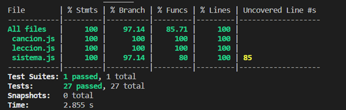
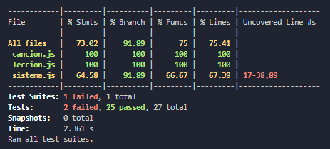
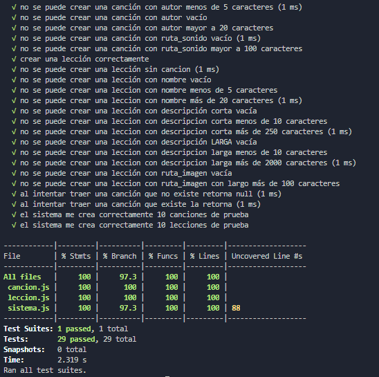

# PRUEBAS UNITARIAS

En esta sección explicamos la implementación de pruebas unitarias al código, las cuales desarrollamos utilizando la herramienta JEST, la cual permitió realizar y verificar las pruebas que hemos creado. [Sitio Oficial de jestjs](https://jestjs.io/).

Una aclaración importante es que en un principio para poder correr las pruebas unitarias, tuvimos que replicar las Clases en una carpeta aparte, ya que el uso del “require(…)” que era necesario para correr las pruebas con JEST, no era soportado cuando intentábamos correr la aplicación al no ser una función propia de JavaScript.

Nuestro diseño dado el factor tiempo, en esta primera versión se remitió a la creación de las siguientes clases del dominio:

- Class Sistema
- Class Canción
- Class Lección

Las clases canción, y lección la única funcionalidad que tienen son los métodos constructures.

La clase Sistema, tiene las siguientes funciones:

- crearLeccion( nombre, descripCorta, cancion, ruta_imagen, descripLarga )
- crearCancion( nombre, tablatura, autor, ruta_sonido )
- traerCancion ( id )

Las pruebas unitarias creadas fueron para probar la clase Sistema, la cual es la que tiene la funcionalidad relevante.

Para cumplir con dicha tarea, se desarrollaron 27 test, abarcando el 100% de las líneas de código y el 97% de las ramas.  

Esta es una captura del coverage realizado antes de implementar el código en los documentos .html:

## Primera reestructura

Al momento de implementar la funcionalidad en los documentos .html, hubo que reestructurar el código de las clases del sistema, lo que provocó fallas en las pruebas, a continuación se muestra los resultados de las mismas:

Esto se debe a que se sumaron funciones para crear datos de prueba y se hicieron algunos cambios necesarios para que la aplicación funcione correctamente, por ejemplo, que la función crearCanción me devuelva la canción creada.

Al momento de corregir las pruebas, se detecta que los nombres debían describir correctamente lo que hacía la prueba, por ejemplo, si era la prueba para comprobar que no se crean canciones sin nombre, en lugar de llamarse: "crear canciones con nombre ''", se debería llamar "no se puede crear canciones con nombre ''". 

Lo anterior comprueba que es más sencillo que el nombre describa correctamente la funcionalidad probada.

Luego de subsanar los errores y nuevas funcionalidades, se obtiene el siguiente resultado:

Como lección aprendida, fue que gracias al uso de las pruebas unitarias, pudimos detectar una gran cantidad de fallas de la lógica del código mucho antes de tener la página funcionando, ya que las mismas se pueden ejecutar independientemente. La gran ventaja es que como se ejecutan en poco tiempo, el proceso de solucionar fallas se hizo más dinámico y fácil para el trabajo en equipo ya que contribuyen a entender el código base facilmente. 

Además se cuenta con que el trabajo realizado una vez, respalda los cambios y reestructuración de código, así como cuando en el futuro se actualicen las tecnologías aplicadas, por lo que el esfuerzo realizado una vez, nos avala en el futuro, permitiéndonos ahorrar tiempo a largo plazo.